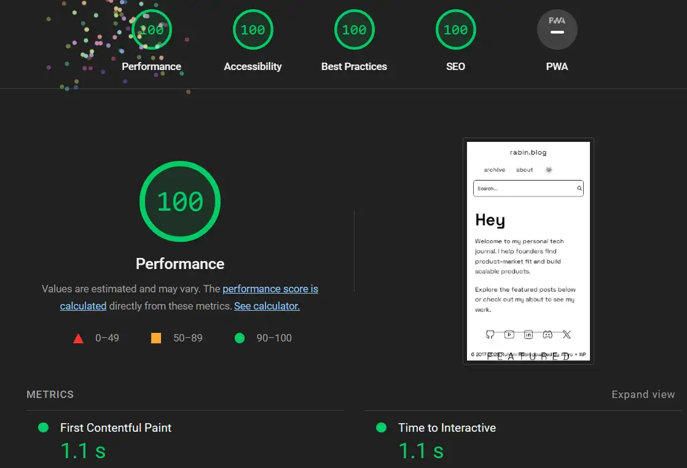
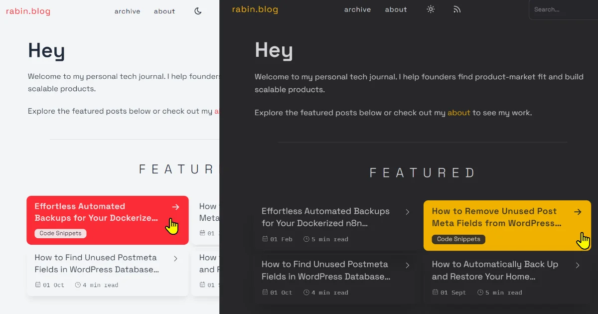
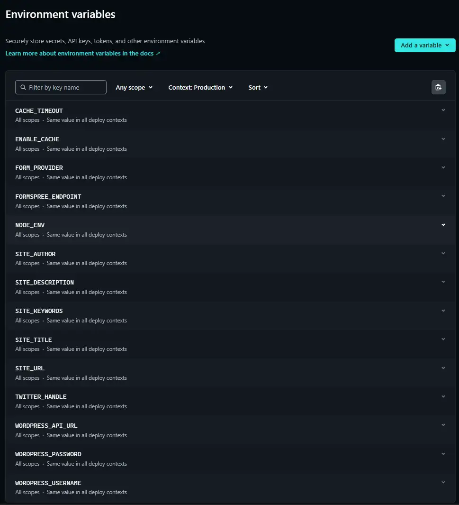

# Astro Headless WordPress (Ryze-theme)

A modern, reader‑friendly Astro starter that uses **WordPress as a headless CMS**. It’s based on the [Ryze Astro theme](https://github.com/8366888C/Ryze), adapted for WordPress content and optimized for speed, accessibility, and SEO.

## Live Preview
[](https://rabin.blog)

[Rabin.blog](https://rabin.blog)

Deploy your own with Netlify:

[](https://app.netlify.com/start/deploy?repository=https://github.com/ruhanirabin/astro-wordpress-headless-ryze/)

## Features

- Headless WordPress via REST API
- WordPress featured image support for open graph tags
- WordPress images pulled and cached locally so if WordPress goes down, images and content are still available
- Static site generation with Astro
- Archive with year filter + pagination
- Category listings
- Featured posts section
- Fuse.js client‑side search
- Highlight.js for code syntax highlighting for both dark and light themes - uses JetBrains Mono for PRE/Code font
- Dark/light theme toggle and also supports syntax highlighting
- RSS + sitemap generation - no duplicate pages
- Tailwind CSS v4 styling
- Posts only, pages are manually managed via page-name.md
  
## Performance



## Preview



## Project Structure

```
astro-headless/
├── public/                 # Static assets
├── src/
│   ├── assets/             # SVGs, icons
│   ├── components/         # UI + blog components
│   ├── layouts/            # Base & post layouts
│   ├── lib/                # WordPress client + utilities
│   ├── pages/              # Routes
│   │   ├── archive/        # Archive landing + year filters
│   │   ├── category/       # Category listings
│   │   ├── [slug].astro    # Post page
│   │   ├── index.astro     # Homepage
│   │   ├── rss.xml.ts      # RSS feed
│   │   └── robots.txt.ts   # Robots
│   └── styles/             # Global styles
├── netlify.toml            # Netlify deployment config
├── astro.config.mjs
├── package.json
└── README.md
```

## Requirements

- Node.js 20+ (22 strongly recommended)
- A WordPress site online - with REST API enabled. 
- This site does not need to be on a high powered server. You can use a low cost VPS or shared cPanel hosting.

## Quick Start

1. Install dependencies:

```bash
npm install
```

2. Create your `.env` file:

```bash
cp .env.example .env
```

3. Fill in required variables:

```env
WORDPRESS_API_URL=https://example.com/wp-json/wp/v2
WORDPRESS_USERNAME=your-username
WORDPRESS_PASSWORD=your-app-password
SITE_URL=https://example.com
SITE_TITLE=My Technology Journal
SITE_DESCRIPTION=Exploring WordPress, automation, development, and tech insights.
SITE_AUTHOR=Your Name
```

4. Run the dev server:

```bash
npm run dev
```

Open `http://localhost:4321`.

## Routes

- `/` home
- `/archive` all posts (paginated)
- `/archive/{year}` posts filtered by year (paginated)
- `/category/{slug}` posts filtered by category
- `/{slug}` single post

## Netlify Deployment

This repo is ready for Netlify and includes `netlify.toml`.

### Deploy your own with Netlify:

[](https://app.netlify.com/start/deploy?repository=https://github.com/ruhanirabin/astro-wordpress-headless-ryze/)

### 1. Create a Netlify site

- Connect your Git repo in Netlify.

### 2. Build settings

- Build command: `npm run build`
- Publish directory: `dist`
- Node version: `22`

Netlify will also apply redirects and headers from `netlify.toml`.

### 3. Environment variables

Set these in Netlify → Site settings → Environment variables:

- `WORDPRESS_API_URL`
- `WORDPRESS_USERNAME` (optional if public data only)
- `WORDPRESS_PASSWORD` (optional if public data only)
- `SITE_URL`
- `SITE_TITLE`
- `SITE_DESCRIPTION`
- `SITE_AUTHOR`
- Optional SEO/analytics: `SITE_KEYWORDS`, `TWITTER_HANDLE`, `DEFAULT_OG_IMAGE`, `GOOGLE_ANALYTICS_ID`, `GOOGLE_TAG_MANAGER_ID`

#### 3.a. Netlify Variables Screen


### 4. Deploy

Push to your default branch and Netlify will build and deploy.

### 5. Automatically run deployments

Netlify will build and deploy automatically when WordPress content changes.

You can use the code snippet below to trigger a rebuild when WordPress content changes.


## Commands

| Command           | Description                  |
| ----------------- | ---------------------------- |
| `npm run dev`     | Start dev server             |
| `npm run build`   | Build static site to `dist/` |
| `npm run preview` | Preview production build     |

## Credits

Based on the Ryze theme layout and styling, Powered by AstroJS - adapted for WordPress headless content.
